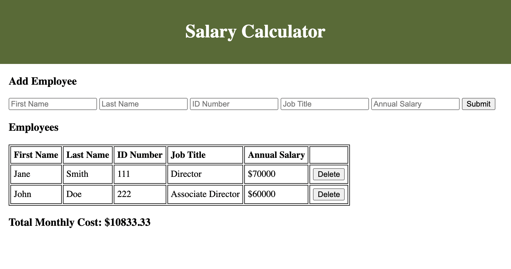

# Salary Calculator

## Description
---

Duration: 3 days

I created an application that records employee salaries and calculates monthly salary costs for the company. 

To accomplish this, I first created funcionality to take in user input information for an employee and add that information to the DOM as a row in a table. I then added functionality to take in all employee salaries and calculate the total monthly cost for the company. If the total monthly cost exceeds $20,000, a red background color is displayed. Lastly, I created functionality to delete an employee from the table and deduct that employee's salary from the total monthly cost.

## Screen Shot
---

## Usage
---
1. Fill each input field with employee's information.

2. Click submit to add employee to the table.

3. To remove an employee, click the 'delete' button on the right of the employee's row in the table.

## Built With
---
- HTML
- CSS
- JavaScript
- jQuery

## Acknowledgment
---
Thank you to Prime Digital Academy, my instructor and my classmates who equipped and helped me to make this application.